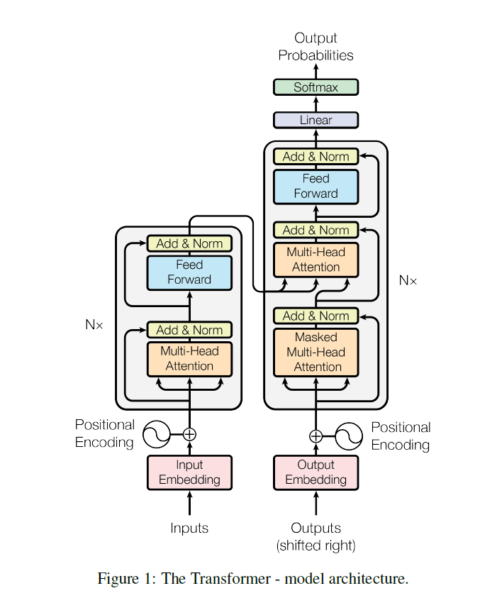
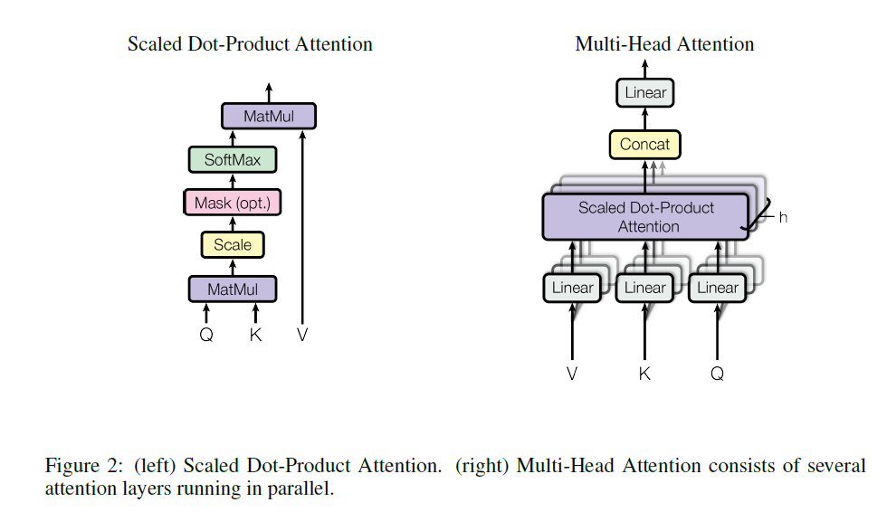

# 《Attention Is All You Need》阅读笔记

> 论文：Ashish Vaswani et al.  
> 会议：NeurIPS 2017  
> 关键词：Transformer, Self-Attention, Multi-Head Attention, Positional Encoding

---

## 1. 论文要解决什么问题

在 Transformer 出现之前，主流序列到序列模型大多依赖 **RNN / LSTM / GRU** 或 CNN，再辅以 attention 机制。论文指出，这类模型存在两个主要问题：

1. **串行计算严重**：RNN 按时间步递推，训练难以并行。
2. **长距离依赖学习困难**：信息需要跨很多步传播，路径较长。

论文提出：**能否完全去掉 recurrence 和 convolution，只靠 attention 来完成序列建模？**

答案就是 **Transformer**。论文摘要强调，Transformer **完全基于 attention 机制**，在机器翻译上效果更好、并行性更强、训练时间更短。

---

## 2. Transformer 的整体结构



Transformer 仍然保持 **Encoder-Decoder** 总体框架。

### 2.1 Encoder
Encoder 由 **N = 6** 个相同层堆叠组成。每层有两个子层：

1. **Multi-Head Self-Attention**
2. **Position-wise Feed-Forward Network**

每个子层外都有：

```math
\mathrm{LayerNorm}(x + \mathrm{Sublayer}(x))
```

也就是：
- 先做子层计算
- 再做残差连接
- 最后做 LayerNorm

### 2.2 Decoder
Decoder 同样由 **N = 6** 层组成。每层有三个子层：

1. **Masked Multi-Head Self-Attention**
2. **Encoder-Decoder Attention**
3. **Position-wise Feed-Forward Network**

这里最关键的是：

- **Masked Self-Attention**：保证当前位置不能看到未来词，保持自回归生成
- **Encoder-Decoder Attention**：让 decoder 在生成输出时查看 encoder 的输入表示

---

## 3. Attention 的核心公式



论文提出的核心注意力形式是 **Scaled Dot-Product Attention**：

```math
\mathrm{Attention}(Q, K, V)
=
\mathrm{softmax}\left(\frac{QK^T}{\sqrt{d_k}}\right)V
```

### 3.1 Q / K / V 含义
- **Q (Query)**：当前位置想找什么信息
- **K (Key)**：每个位置提供什么“可匹配特征”
- **V (Value)**：每个位置真正传递的信息内容

### 3.2 为什么要除以 \(\sqrt{d_k}\)
如果 \(d_k\) 很大，点积会变大，softmax 容易进入梯度很小的区域，所以论文加入缩放项：

```math
\frac{1}{\sqrt{d_k}}
```

来稳定训练。

---

## 4. Multi-Head Attention

单头 attention 容易把不同类型关系平均掉，因此论文提出：

```math
\mathrm{MultiHead}(Q, K, V)
=
\mathrm{Concat}(\mathrm{head}_1, \dots, \mathrm{head}_h)W^O
```

其中：

```math
\mathrm{head}_i
=
\mathrm{Attention}(QW_i^Q, KW_i^K, VW_i^V)
```

### 4.1 核心思想
不是做一次 attention，而是：

- 先把 Q / K / V 投影到多个不同子空间
- 每个子空间里并行做 attention
- 最后把多个头拼接起来

### 4.2 为什么有效
不同 head 可以学习不同关系，例如：

- 长距离依赖
- 句法结构
- 指代关系
- 局部搭配

### 4.3 论文中的设置
base model 使用：
- \(h = 8\)
- \(d_k = d_v = d_{model}/h = 64\)

由于每个头维度更小，总计算量与单头 full-dim attention 接近。

---

## 5. FFN（逐位置前馈网络）

除了 attention，每层还有 FFN：

```math
\mathrm{FFN}(x)
=
\max(0, xW_1 + b_1)W_2 + b_2
```

作用：
- attention 负责位置之间的信息交互
- FFN 负责对每个位置自身表示做非线性变换

base model 中：
- 输入输出维度：\(d_{model} = 512\)
- 中间层维度：\(d_{ff} = 2048\)

---

## 6. Positional Encoding（位置编码）

由于 Transformer 没有 RNN，也没有 CNN，本身不带顺序信息，因此必须显式加入位置编码。

论文使用的是固定的正弦/余弦形式：

```math
PE(pos, 2i) = \sin\left(pos / 10000^{2i/d_{model}}\right)
```

```math
PE(pos, 2i+1) = \cos\left(pos / 10000^{2i/d_{model}}\right)
```

### 6.1 为什么这样设计
- embedding 告诉模型“这是什么词”
- positional encoding 告诉模型“它在第几位”

### 6.2 为什么不用学习式位置向量
论文也试过 learned positional embeddings，结果与 sinusoidal 版本几乎一样。最终保留 sinusoidal，是因为作者认为它更可能外推到更长序列。

---

## 7. 为什么 Self-Attention 比 RNN/CNN 更合适

论文 Table 1 比较了不同结构的复杂度、顺序操作数和最大路径长度。

### Table 1 的核心意思

| Layer Type | Complexity per Layer | Sequential Operations | Maximum Path Length |
|---|---:|---:|---:|
| Self-Attention | \(O(n^2 \cdot d)\) | \(O(1)\) | \(O(1)\) |
| Recurrent | \(O(n \cdot d^2)\) | \(O(n)\) | \(O(n)\) |
| Convolutional | \(O(k \cdot n \cdot d^2)\) | \(O(1)\) | \(O(\log_k n)\) |
| Restricted Self-Attention | \(O(r \cdot n \cdot d)\) | \(O(1)\) | \(O(n/r)\) |

### 这张表要记住什么
1. **RNN 需要顺序计算**，无法在序列维度并行
2. **Self-Attention 路径最短**，更容易学长距离依赖
3. 虽然 self-attention 是 \(O(n^2)\)，但在常见句长下，它的并行优势非常明显

---

## 8. 训练设置（论文第 5 节）

### 8.1 数据集
#### WMT 2014 English-German
- 约 **4.5M** 句对
- BPE 词表约 **37,000** token（source-target 共享）

#### WMT 2014 English-French
- 约 **36M** 句对
- 词表约 **32,000** word-piece

### 8.2 Batch
每个 batch 大约：
- 25,000 source tokens
- 25,000 target tokens

### 8.3 硬件
- 8 张 **NVIDIA P100 GPU**

### 8.4 训练时长
#### base model
- 100,000 steps
- 约 **12 小时**

#### big model
- 300,000 steps
- 约 **3.5 天**

---

## 9. 优化器与学习率

论文使用 **Adam**：

- \(\beta_1 = 0.9\)
- \(\beta_2 = 0.98\)
- \(\epsilon = 10^{-9}\)

学习率策略：

```math
\mathrm{lrate}
=
d_{model}^{-0.5}
\cdot
\min\left(step\_num^{-0.5},\ step\_num \cdot warmup\_steps^{-1.5}\right)
```

其中：

- \(warmup\_steps = 4000\)

### 这个公式的含义
- 前期：学习率线性升高（warmup）
- 后期：学习率按 \(step^{-0.5}\) 衰减

这就是后来常说的 **Noam learning rate schedule**。

---

## 10. 正则化

论文用到三种重要正则化：

### 10.1 Dropout
- base model: \(P_{drop}=0.1\)
- big model: 更大（英法 big 用 0.1，论文中 big 通常为 0.3）

### 10.2 Residual Dropout
对子层输出做 dropout，再 residual + norm

### 10.3 Label Smoothing
- \(\epsilon_{ls} = 0.1\)

论文指出：
- label smoothing 会让 perplexity 变差一些
- 但会提升 accuracy 和 BLEU

---

## 11. 机器翻译主实验（Table 2）

### Table 2 的作用
这张表是论文最重要的主实验对比表。它比较了：

- 不同模型在 **EN-DE / EN-FR** 上的 BLEU
- 以及训练成本（FLOPs）

### Table 2 核心结果

| Model | EN-DE BLEU | EN-FR BLEU |
|---|---:|---:|
| ByteNet | 23.75 | - |
| GNMT + RL | 24.6 | 39.92 |
| ConvS2S | 25.16 | 40.46 |
| MoE | 26.03 | 40.56 |
| Transformer (base) | 27.3 | 38.1 |
| Transformer (big) | **28.4** | **41.8** |

### 这张表说明什么
1. Transformer 在 EN-DE 上达到 **28.4 BLEU**
2. 在 EN-FR 上达到 **41.8 BLEU**
3. 不仅效果更好，训练成本也更低
4. 说明 Transformer 的优势不是单纯“堆算力”，而是结构上更优

---

## 12. 消融实验（Table 3）

### Table 3 的作用
Table 3 用来研究 Transformer 各组件是否真的有用。  
它在 English-to-German development set 上改变模型设置，看 perplexity、BLEU 和参数量怎么变。

### 12.1 Base model 配置
- \(N=6\)
- \(d_{model}=512\)
- \(d_{ff}=2048\)
- \(h=8\)
- \(d_k=d_v=64\)
- dropout = 0.1
- label smoothing = 0.1

### 12.2 Rows (A)：改变 head 数量
论文比较：
- 1 头
- 4 头
- 8 头
- 16 头
- 32 头

**结论：**
- 单头明显差一些
- 8 头表现很好
- 头太多也不一定更好

这说明 multi-head 不是形式主义，它确实提升了表达能力。

### 12.3 Rows (B)：改变 \(d_k\)
这里研究 key/query 维度太小会怎样。

**结论：**
- 减小 \(d_k\) 会损伤效果
- 说明“相关性匹配空间”不能太窄

### 12.4 Rows (C)：改变模型大小
这里主要比较：
- 更小模型
- 更大模型

**结论：**
- 更大的模型通常 perplexity 更低、BLEU 更高
- Transformer 明显能从模型扩展中获益

### 12.5 Rows (D)：改变 dropout
**结论：**
- 没有 dropout 时效果明显下降
- dropout 对防止过拟合很重要

### 12.6 Row (E)：比较位置编码形式
- sinusoidal positional encoding
- learned positional embedding

**结论：**
- 两者结果几乎一样
- 所以论文最后选择 sinusoidal 版本

---

## 13. 句法分析实验（Table 4）

### Table 4 的作用
论文不仅做机器翻译，还做了英语成分句法分析（English constituency parsing），检验 Transformer 是否能泛化到其他任务。

### 核心结果
Transformer (4 layers)：
- WSJ only：**91.3 F1**
- semi-supervised：**92.7 F1**

### 结论
Transformer 不只是适合翻译，也是一种更一般的序列建模架构。

---

## 14. 论文结论总结

### 14.1 结构层面
Transformer 是第一个**完全基于 attention 的序列转换模型**，不再依赖 RNN/CNN。

### 14.2 方法层面
论文提出并系统化了：
- Scaled Dot-Product Attention
- Multi-Head Attention
- Positional Encoding
- Encoder-Decoder 中基于 self-attention 的堆叠结构

### 14.3 实验层面
在 WMT14 机器翻译任务上：
- EN-DE：**28.4 BLEU**
- EN-FR：**41.8 BLEU**

并且训练成本显著低于很多已有模型。

### 14.4 历史意义
Transformer 改变了序列建模范式。后续的：
- BERT
- GPT
- T5
- ViT
- 大语言模型

本质上都建立在这篇论文的思想之上。

---

## 15. 我自己的理解

这篇论文真正革命的点不是“提出了 attention”，因为 attention 在它之前已经存在；真正革命的是：

> **作者把 attention 从“辅助模块”提升成了“主干架构”。**

也就是说，Transformer 不是“给 RNN 加一个更强 attention”，而是直接说：

> **attention 本身就足以成为序列建模的核心。**

这一步，奠定了后面整个大模型时代的基础。
